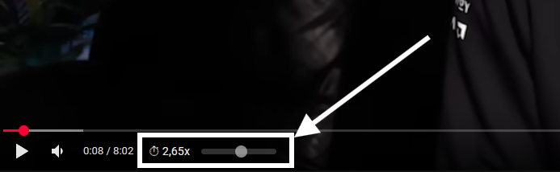
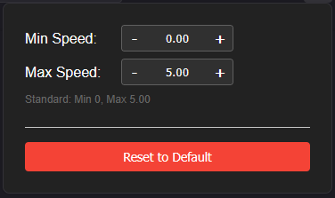

# YouTube Speed Slider - Add-on

> This is an Updated Version of the [youtube-speed-controls](https://github.com/Kissaki/youtube-speed-controls) Firefox Add-on by [Jan Klass](https://github.com/Kissaki).

Add playback speed indicator and controls to the YouTube video player bottom left.

## Developing

in Firefox:

* go to `about:debugging#/runtime/this-firefox`
* press `Load Temporary Add-on`
* then select the `manifest.json` file in this directory

## Publish

### local

* run `./pack.ps1`
* go to `about:debugging#/runtime/this-firefox`
* select the zip

### on Marketplace

* run `./pack.ps1`
* go to: <https://addons.mozilla.org/en-US/developers/addons>
* Add new Addon / New Version
* select the zip

## TODO

* optimize for shorts
* add extention options for changing the max speed
* make the slider only apper when hovering
